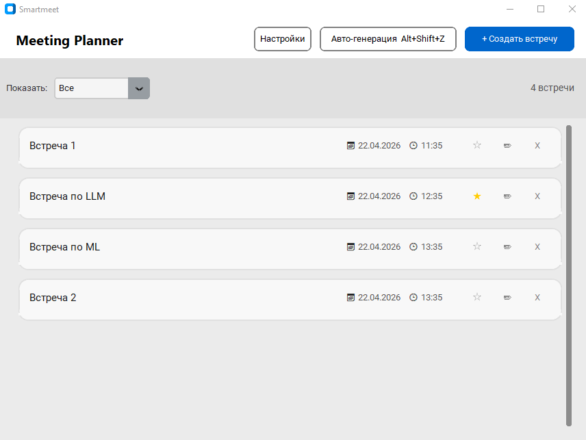
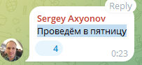
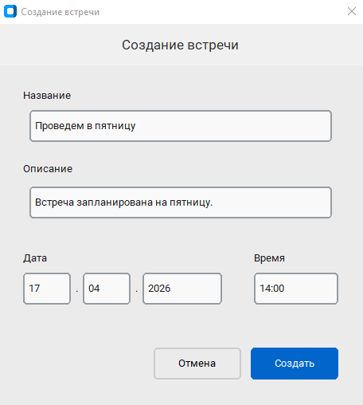
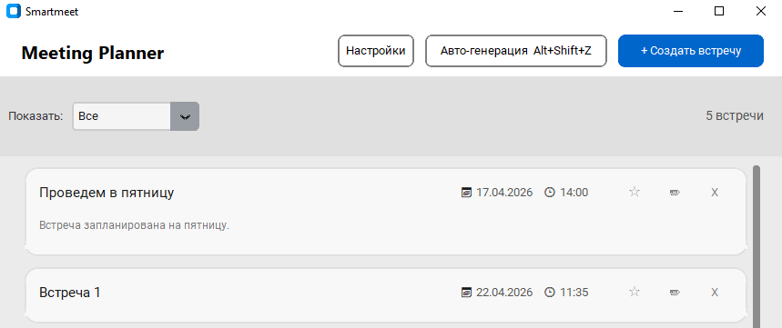

# Smartmeet - приложение для планирования встреч

## О проекте
**Тема проекта:** приложение автоматизированного планирования встреч.

**Проблема:** пользователь сталкивается с большим числом текстовых (и др.) сообщений о просьбах назначить встречу. Многие из них теряются или забываются, в результате чего пользователь не приходит на встречи или опаздывает на них.
### Состав команды
- Николаев Артем (разработчик/LLM)
- Лозовой Павел (менеджер/архитектор/разработчик)
- Гомбоев Чимит (аналитик/тестировщик)
- Николаева Мария (аналитик/дизайнер/тестировщик)

### Артефакты фаз
- [Фаза 1](https://docs.google.com/document/d/1eRV8bLaSCGb0e4cF-7HdcH5fUBbV6i9Bf2lgD-a9ZRE/edit?usp=drive_link)
- [Фаза 2](https://docs.google.com/document/d/1iw_UiGoXuy1w4bvtlXkA1M4i7AzlWdUK6zoAaw9La30/edit?usp=drive_link)
- [Фаза 3](https://docs.google.com/document/d/1SiF5_AzQt0ld0_EosMX036aMkXzaasxI8lXJOkngkKc/edit?usp=sharing)

## Приложение
В приложении реализованы сценарии:
- Создать встречу по выделенному тексту, создать встречу вручную (архитектурно-значимый вариант использования)   
- Просмотреть встречи
- Отменить встречу
- Перенести встречу
- Получить уведомление

Также возможно изменить параметры коллизии встреч и времени отправки уведомлений.

Главное окно приложения представлено ниже.

Пользователь может редактировать встречи в списке, нажав на иконку карандаша. 
Отмена (удаление) встреч происходит путем нажатия на иконку удаления.
Встречи могут быть омечены как важные нажатием на иконку звездочки.

Пользователь может сортировать встречи - отобразить ближайшие, на день, на неделю, важные - выбрав соответствующий пункт в выпадающем меню на верхней панели.
### Создание встреч
Создание встреч может происходить как автоматически, так и вручную. Для создания встречи вручную необходимо нажать на соответствующую кнопку на верхней панели. 

Для создания встречи автоматически приложение должно быть запущено, пользователь выделяет некоторый текст и нажимает комбинацию клавиш Alt+Shift+Z.

После сохранения встреча отображается в списке на главном экране.

Примечание: скриншоты выше были созданы на момент последнего релиза

### Запуск приложения
Для запуска подготовлен релиз. Необходимо скачать архив main.rar, после чего запустить main.exe. Запуск приложения может занять некоторое время (до полминуты).

Приложение сворачивается в трей при закрытии основного окна. Чтобы окончательно закрыть приложение, необходимо нажать правой клавишей по синей иконке, и выбрать "Quit".
